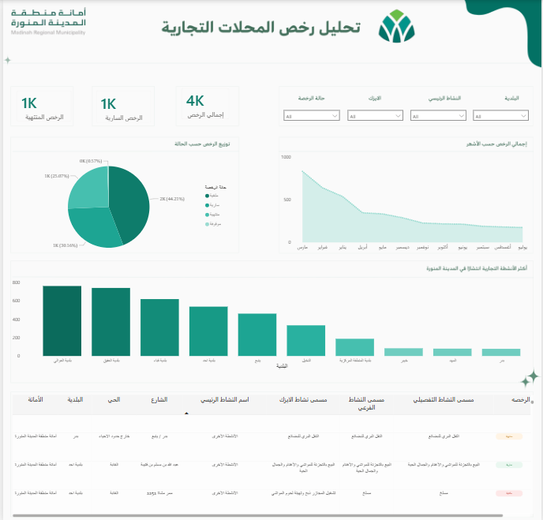

# 📊 Madinah Commercial Licenses Dashboard

This project presents an **interactive Power BI dashboard** analyzing commercial shop licenses issued by **Madinah Regional Municipality**.

The dashboard provides insights into the distribution of business activities across the city and highlights trends in commercial licensing.

---

## 🚀 Project Overview

This dashboard analyzes commercial license data and provides insights into:

- 📌 Total number of commercial licenses  
- ✅ Active licenses  
- ⏳ Expired licenses  
- 🟢 License status distribution  
- 📈 Monthly trend of commercial licenses  
- 🏙️ Top districts with the highest commercial activity  
- 📋 Detailed information about licensed businesses  

---

## 📊 Dashboard Features

The dashboard includes several interactive visualizations:

### 🔢 KPI Cards
Key indicators including:
- Total Licenses
- Active Licenses
- Expired Licenses

### 🟢 Pie Chart
Shows the **distribution of licenses by status**.

### 📈 Line Chart
Displays **monthly trends of commercial licenses**.

### 📊 Bar Chart
Highlights the **top districts with the highest commercial activity**.

### 📋 Detailed Table
Provides information about licensed businesses including:
- Municipality
- District
- Street
- Business activity
- License status

### 🎛️ Interactive Filters
Users can explore the data using filters such as:
- Municipality
- District
- Main Activity
- License Status

---

## 🛠 Tools & Technologies

- 📊 Power BI  
- 🧹 Data Cleaning  
- 📈 Data Visualization  
- 🔍 Exploratory Data Analysis (EDA)

---

## 🗂 Dataset

The dataset contains commercial licensing data from the **Madinah Municipality Open Data Portal**.

---

## 🖼 Dashboard Preview

Below is a preview of the Power BI dashboard:

---

## 🎯 Project Goal

The goal of this project is to transform raw municipal data into **clear visual insights** that help understand commercial activity patterns in Madinah.

This project demonstrates skills in:

- 📊 Data Analysis  
- 📈 Data Visualization  
- 📉 Dashboard Design  
- 🧠 Business Intelligence Reporting
